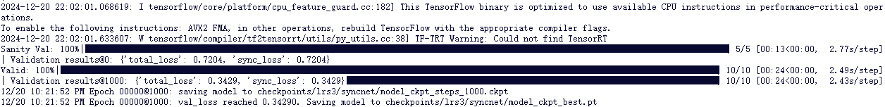
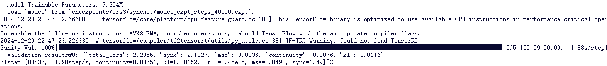

# 实验记录1221

我居然我不小心把前两天的记录丢掉了。。。

不过换了新环境，之前的也不重要

## 训练

### SyncNet

原作训练40000步，预计需要80+小时，为省时只训练1000步



### Audio2Motion

原作训练40000步，预计需要55+小时，为省时只训练2000步

注，本步的脚本读取的SyncNet模型文件是`model_ckpt_steps_40000.ckpt`，所以我直接将上一步的1000步文件改成这个名了，并不是真的训练了40000步



### PostNet

折腾了两个小时的`AttributeError: 'PostnetAdvSyncTask' object has no attribute '_lazy_val_dataloader'`

没有解决，遂放弃，使用现成模型（写报告时润色下这里）

理论上PostNet这部分是有前两个模型参与的，不知道对结果分数影响如何

### RAD-NeRF

1．radnerf

    降级pillow至7.2.0可运行（pip显示降级影响scikit，但似乎能跑）

    @徐帅，你如果看到左边训练完了（应该是训练到250000步，可能中午就能好），跑一下下面这个命令

    ``` sh
    CUDA_VISIBLE_DEVICES=0 python tasks/run.py --config=egs/datasets/videos/May/lm3d_radnerf_torso.yaml --exp_name=May/lm3d_radnerf_torso
    ```

2. nerf_torso

## 输出

需修改`inference/nerfs/base_nerf_infer.py`中的编码至`mpeg4`

## 评估

评估方法：将May的源音频输入模型，将输出视频和源视频截取前1分20秒11帧做对比

### 自训练模型

- PSNR: 24.84
- NIQE: 7.06
- FID: 108.51
- SSIM: 0.78

### 实例模型（源论文成果）

- PSNR: 24.77
- NIQE: 7.05
- FID: 105.39
- SSIM: 0.78

