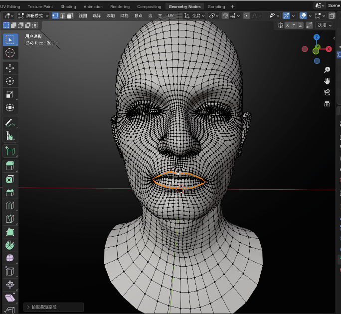
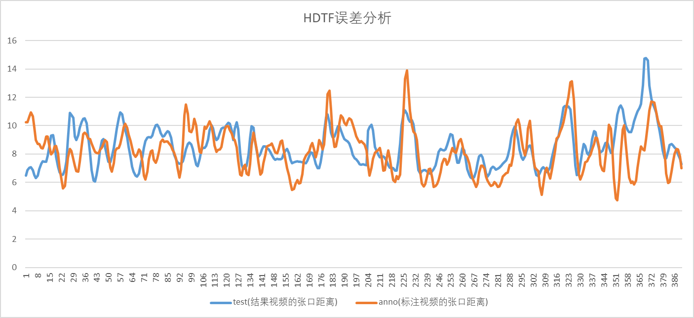
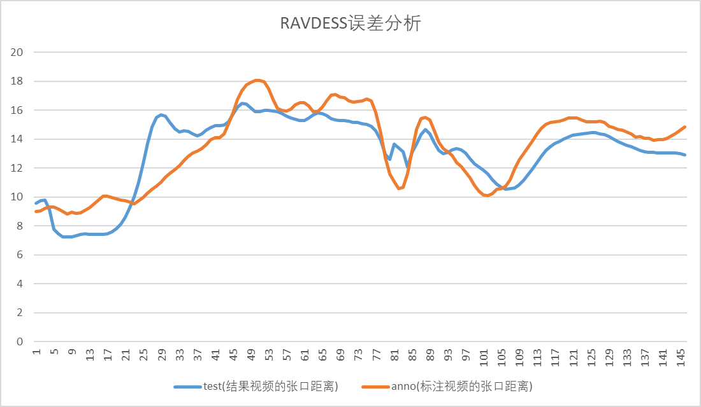
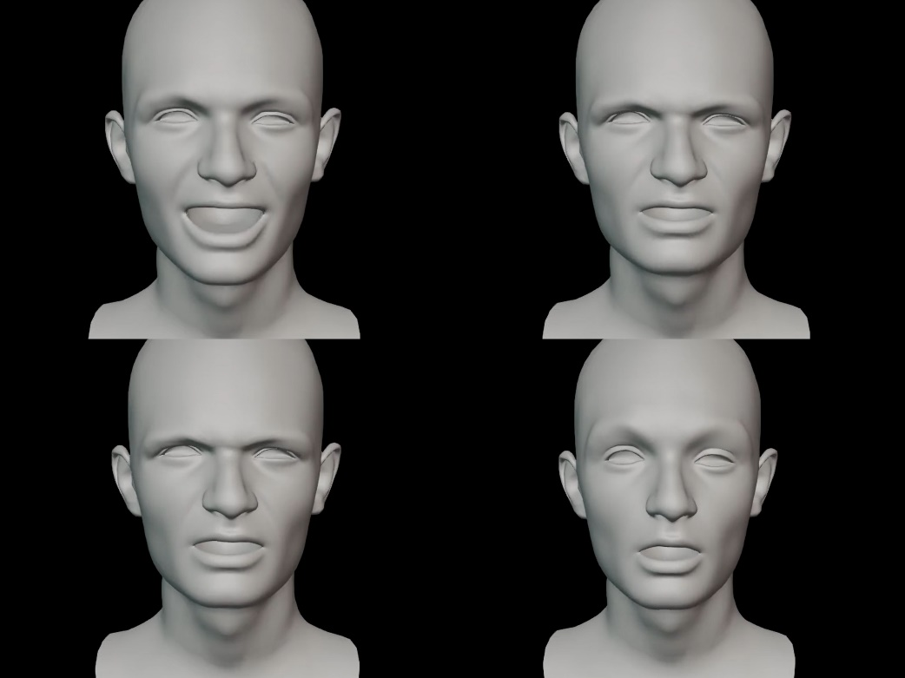

此readme节选自《实验报告》的《3.1定量评估结果》

**定性评估结果**

定性评估方面，我们的工作主要关注模型在口型同步和情感表达方面的能力。

1.口型同步

本模型数据库的构建是基于作者提出的52个标准表情FLAME Head Templates完成的，在blender中这52个Flame Head作为Shape Key
混合输出最终的图像，因此我们选取Flame Head中上下唇各一个顶点（65号与67号）作为关键点，计算这两点之间的距离来衡量每一帧表情的张口距离，并将输出视频的张口距离和原标注集的数据进行对比。

{width="3.109027777777778in"
height="2.861111111111111in"}

图9：blender标注唇关键点

通过分别对来自原作者数据集中的两个音频HDTF.wav和RAVDESS.wav进行评估后得到以下结论：

{width="5.15625in"
height="2.361111111111111in"}

{width="5.322222222222222in"
height="3.0972222222222223in"}

统计图中的横轴代表图像帧号，纵轴代表两个关键点之间的距离，结果显示，生成视频的张口距离趋势变化与原标注数据基本一致，证明本模型在口型同步方面有较好的性能，统计每一帧的平均误差，RAVDESS.mp4生成视频的平均误差为10.76%，HDTF.mp4生成视频的平均误差为15.66%。

2.情感表达

本模型在情感表达方面也具有较好的性能，能提取语音中的情感特征，增强生成的3D面部动画。使用原项目中有明显情绪特征的语音生成视频，能体现出不同情绪下生成面部表情的区别。

{width="4.7347222222222225in"
height="3.5479166666666666in"}

图 10：不同情感下的表情(Happy, Angry, Disgust, Sad)
