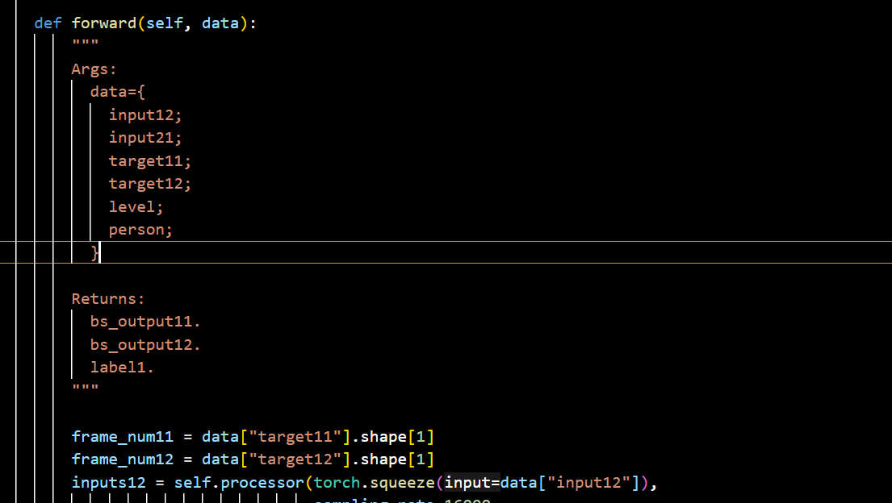
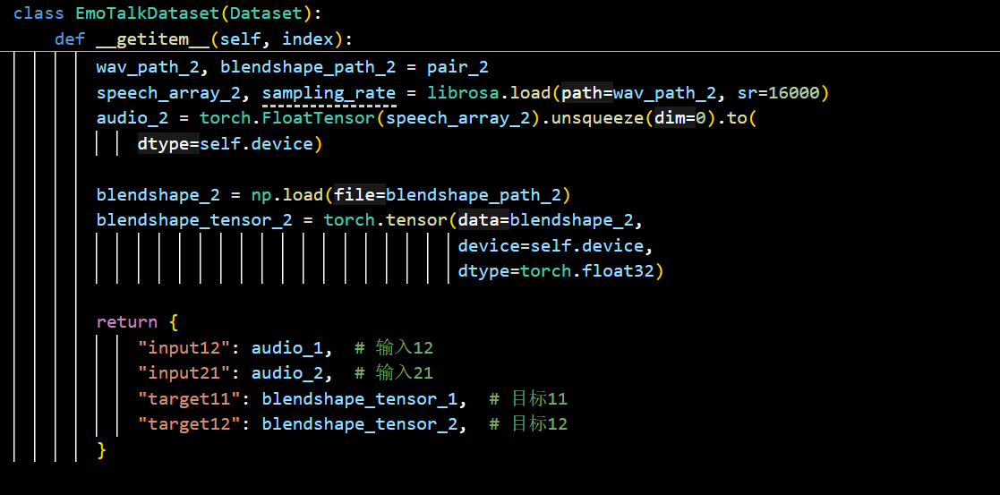

# Emotalk训练

### 我们复现的最终模型：

通过网盘分享的文件：emotalk_model_only_params.pth
链接: https://pan.baidu.com/s/1EkeNTIqZ5QIZwLBmYHSGVA?pwd=fiuu 提取码: fiuu 
--来自百度网盘超级会员v5的分享

### 训练代码讲解视频：

通过百度网盘分享的文件：Emotalk训练代码解释视频.mp4
链接：https://pan.baidu.com/s/1Jujn-PDhUfhRrqJB2xDCCQ?pwd=lqfs 
提取码：lqfs

### 邮件记录&氪金记录：

训练部分所有资料会尽快发到助教邮箱，后面内容就是《代码说明报告》：

## 1.3D-ETF数据集

数据集包括两个广泛使用的 2D 视听数据集，RAVDESS和HDTF。 RAVDESS数据，也被称为瑞尔森情感言语和歌曲的视听数据库，是一个多模态情绪识别数据集，由24 名演员（12 名男性，12名女性）和1440个简短演讲视频剪辑组成。该数据集是通过高质量的音频和视频记录捕获的，并指示演员表达特定的情绪，包括中性、平静、快乐、悲伤、愤怒、恐惧、厌恶和惊讶。HDTF数据集是过去几年从YouTube
获取的大约16小时的720P-1080P视频的集合。该数据集包括300多个主题和10k个不同的句子。

来自 RAVDESS 数据集的1440个视频和来自 HDTF数据集的385个视频被处理，将它们转换为每秒 30帧并捕获每帧的面部混合形状。为了提高数据集的质量并减少帧到帧的抖动，将窗口长度为5、多项式阶数为2的Savitsky-Golay滤波器应用于输出的blendshape 系数，这显着提高了面部动画的平滑度。RAVDESS 数据集生成了159,702 帧的 blendshape 系数，相当于大约 1.5小时的视频内容。同时，HDTF数据集生成了543,240帧的blendshape系数，相当于大约5 小时的视频内容。所有生成的blendshape系数都使用 transform模块转换为网格顶点。

数据集包括audio片段（wav文件）和对应的blendshape系数（npy文件）

**我们在此次训练中只采用了RAVDESS数据集作为输入。**

3D-ETF数据集的下载链接： 

<https://drive.google.com/file/d/1czXc0B_nxN6v2ASD8tpkw4W-QYkE21BG/view?usp=drive_link>

## 2.训练设备及环境

训练设备为华为云中的实例，实例规格为：GPU(1\*Vnt1, 32GB), CPU(8核 64GB)，环境配置为pytorch_2.0.0-cuda_11.7-py_3.9.11-ubuntu_20.04-x86。由于HDTF数据集中每一个audio片段的时长较长（为一分多钟），直接使用占用的显存过大，我们采用了时长较短的RAVDESS数据集（一个片段时长3秒）。训练过程中，占用的显存约为20GB，一共耗时约12小时（每个epoch耗时约9分钟）。

## 3\. 训练过程及代码介绍

（1）数据集处理

Emotalk类的forward输入和输出参数如图1所示，input12和input21是两个处理过的wav文件，target11和target12是对应的实际blendshape文件，level代表情绪水平，person代表个人风格。输出的bs_output11和bs_output12分别与target11和target12的维度相同，label1代表情绪分类。

{width="5.768055555555556in"
height="3.2569444444444446in"}

图1：Emotalk类forward的参数与输出

因此，我们在构建EmotalkDataset类（继承DataSet类）时随机选取不重复的两个audio文件及对应的blendshape文件作为一对输入，audio文件的处理与demo.py文件中一致。\_getitem_函数返回如下图2，对应Emotalk类forward的输入。

{width="5.768055555555556in"
height="2.8555555555555556in"}

图2：EmotalkDataset类_getitem_函数返回值

（2）checkpoint的保存与加载

Checkpoint的组成包括epoch数量、模型参数、优化器参数和损失函数值。存储形式为pth文件，存储命名方式"emotalk_model"+epoch数+当前时间，总大小约为7.1GB（其中模型参数为大概2.4GB）。

训练开始前，检查模型存储路径下是否已有checkpoint文件。如果存在，加载最新的checkpoint文件并显示epoch数与loss值。当一轮epoch训练完后，保存最新的checkpoint文件并删掉上一轮epoch下的checkpoint文件（否则训练时实例内存不够）。

（3）前向传播与损失函数

损失函数包括四个组成部分：交叉重构损失、自我重构损失、速度损失和分类损失，如图3所示。

{width="5.768055555555556in"
height="1.3020833333333333in"}

图3：损失函数

交叉重构损失包括两个部分，如图4所示，$D\left( E_{c}\left( A_{c1,e2} \right),E_{e}\left( A_{c2,e1} \right) \right)$是一次forward后得到的结果。Emotalk类的predict函数输入值为audio,
level和person，返回为bs_outpu11，$B_{c1,e1}$是$A_{c1,e2}$对应的正确blendshape系数，因此，我们认为在forward中，input12是$A_{c1,e2}$，input21是$A_{c2,e1}$,
bs_output11是$D\left( E_{c}\left( A_{c1,e2} \right),E_{e}\left( A_{e2,e1} \right) \right)$。计算交叉重构损失需要两次forward，第二次将输入调换，都取返回的bs_output11与实际的blendshape系数求均方误差损失MSE。

{width="5.768055555555556in"
height="1.632638888888889in"}

图4：交叉重构损失

自我重构损失如图5所示，计算过程需要进行另一次的forward，输入的input12和input21均为同一个audio片段，即$A_{c1,e2}$，返回的bs_output11与实际的blendshape系数$B_{c1,e2}$求MSE，由于文中并未给出$B_{c1,e1}$和$B_{c1,e2}$的区别，都对应$A_{c1,e2}$，我们在此取同一值。

{width="5.768055555555556in"
height="0.9402777777777778in"}

图5：自我重构损失

速度损失如图6所示，按照定义，$\widehat{b_{t}}$属于预测出的blendshape，$b_{t}$属于实际的blendshape，两者分别减去前一项再求MSE。在这我们选取第一次forward过程中得到的bs_output11作为预测出的blendshape，原因如下：自我重构损失侧重于$A_{c1,e2}$，predict函数返回bs_output11，因此我们认为$A_{c1,e2}$比$A_{c2,e1}$更加重要，第一次forward的两个输入audio及blendshape不同，有更好的学习效果。实际的blendshape就是$A_{c1,e2}$对应的真实blendshape。

{width="5.768055555555556in"
height="1.1708333333333334in"}

图6：速度损失

分类损失如图7所示，由于文章并未给出$y_{ic}$和$p_{ic}$的计算方式，Emotalk类forward所得到的level1维度与bs_output11,bs_output12完全不同，也没有任何说明（发邮件问作者，作者也没有回复），因此我们此次训练不采用分类损失。

{width="5.768055555555556in"
height="1.7381944444444444in"}

图7：分类损失

forward输入的level和person在文中也没有具体说明，因此我们采用与demo.py中的参数一致，一次前向传播包括三个forward,取结果中的三个bs_ouput11来计算损失函数。

（4）训练过程

如图8所示，优化器采用Adam,学习率设置为1e --4，epoch数设置为80。由于每一个audio片段经处理后所得的tensor维度均不同，加载数据集时无法将多对输入压缩为同一个batch，我们的batchsize设置为1,即每次加载一对输入。

{width="5.768055555555556in"
height="0.6277777777777778in"}

图8：训练细节

## 4.代码文件说明

训练代码为model_train.ipynb和model_train.py,提取最终的checkpoint的模型参数代码为extract_model_state.ipynb和extract_model_state.py。

## 5.改进建议

-   如果能知道blendshape的构建流程并将HDTF数据集中的audio切割为更小的片段或者有设备支持，训练输入可以加入HDTF数据集

-   将audio经处理后的tensor维度统一，可以提高batchsize的值以加快训练速度和提高训练效果（我们尝试过线性插值统一维度，但效果较差）。
    
-   理解分类损失的构建方式与forward输出的level1的作用，获得效果更好的损失函数。
