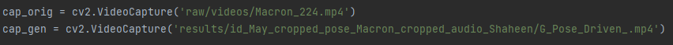
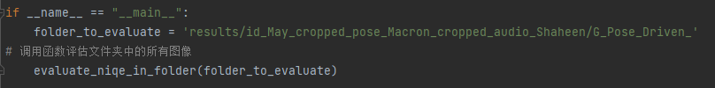

（特别注意：由于评估数据集raw文件夹中的视频过大，无法上传到github上，请自行将raw文件夹放到根目录下）

1. 按照以下代码格式对数据集进行预处理，数据集可选用raw文件夹下的任意视频。 
python scripts/prepare_testing_files.py --src_pose_path /path/to/your/pose_path.mp4 --src_audio_path /path/to/your/audio_path.mp4 --src_mouth_frame_path /path/to/your/mouth_path.mp4 --src_input_path /path/to/your/input.mp4 --csv_path raw/metadata.csv

2. 预处理后会生成文件夹，文件夹包含视频每一帧的图片，按照以下代码格式对图片进行人脸对齐,输入样式是文件夹
python scripts/align_68_new.py --folder_path /path/to/your/folder

3. 人脸对齐后会生成一个全新文件夹，修改raw/metadata.csv文件，将文件内原先写入的文件路径改为新生成的文件夹路径，一般情况文件夹名字为xxx_cropped，（注：修改完后找到mouth_source文件夹中对应的xxx_cropped文件夹，打开之后在文件夹中复制粘贴一份最后一张图片，原因是执行脚本会报错，mouth_source中缺少一张图片）随后执行experiments/demo_vox_new.sh脚本
bash experiments/demo_vox_new.sh

4. 运行结果会保存在results文件夹内。

结果评估：
PSNR:修改PSNR文件如图所示部分，。cap_orig改为原视频的224分辨率视频，cap_gen改为结果文件夹中G_Pose_Driven_.mp4，随后运行文件即可。
注：224分辨率视频获取方法：ffmpeg -i Jae-in.mp4 -vf "scale=224:224" Jae-in_224.mp4（没有ffmpeg通过以下命令安装：pip install ffmpeg）

SSIM：方式同上，修改后运行SSIM.py即可

NIQE：将NIQE.py文件末尾处folder_to_evaluate修改为被测试路径即可，如图所示。修改后执行即可。

FID：按照以下形式执行命令即可，修改命令中的文件路径为被测试路径,第一个路径为 人脸对齐 后的路径。
python -m pytorch_fid /path/to/your/input/folder path/to/your/results/G_Pose_Driven_ --device cuda:0

执行示例如下：
1. 预处理：
 python scripts/prepare_testing_files.py --src_pose_path raw/videos/Jae-in.mp4 --src_audio_path raw/videos/May.mp4 --src_mouth_frame_path raw/videos/May.mp4 --src_input_path raw/videos/Lieu.mp4 --csv_path raw/metadata.csv
2. 人脸对齐：
python scripts/align_68_new.py --folder_path Pose_Source/Jae-in
python scripts/align_68_new.py --folder_path Mouth_Source/May
python scripts/align_68_new.py --folder_path Input/Lieu
3. 修改metadata.csv文件，更改文件路径
4. 执行脚本 ：
bash experiments/demo_vox_new.sh
5. 结果评估

PS：文件夹中的my_image.tar中封装的是docker镜像，docker镜像中有部分预处理过得文件（人脸对齐完毕），可以直接执行脚本，加载后使用即可。
