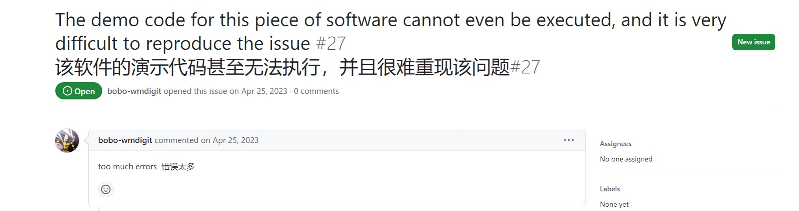
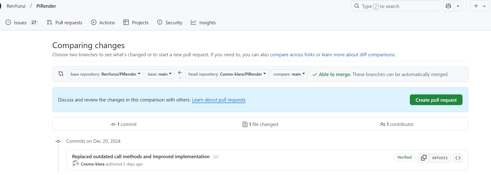

### Deep3DFaceRecon_pytorch

|||
|:--:|:--:|
| **[论文网址](https://arxiv.org/abs/1903.08527)** | **[GitHub](https://github.com/sicxu/Deep3DFaceRecon_pytorch)** |


### 提取 3DMM 参数

#### 环境配置

`nvdiffrast` 需要与底层交互，环境依赖于 CUDA 驱动 ( 而不是 pytorch 安装的 cuda-tookit ), docker 环境也需要参考 linux 或 WSL 安装的驱动 ( WSL 调用的实际是 windows 的显卡驱动 )

> 这个 [issue](https://github.com/sicxu/Deep3DFaceRecon_pytorch/issues/12) 下有 `nvdiffrast` 的替代方案 `pytorch3d` 或许能作为其他解决方案的参考

> 或者可以通过这个[项目](https://github.com/yfeng95/DECA)来提取 3DMM 参数

> 如果提示 pytorch 支持的算力和当前显卡不匹配需要升级 pytorch

1. 克隆项目到本地后进行基本配置

```bash
    conda create -n DP python=3.9
    conda activate DP
    conda install pytorch torchvision torchaudio pytorch-cuda=12.4 -c pytorch -c nvidia
    pip install face_alignment
    pip install ffmpeg-python
    pip install kornia
    pip install trimesh
    pip install Ninja

    # nvdiffrast 经过个人修改，能在 WSL 支持使用 CUDA 而不是 OpenGL 进行渲染
    # nvdiffrast 在 0.3.0 版本后均支持 CUDA，不过我没找到 3DMM 怎么向 nvdiffrast 传参，或许可以通过附加参数使用其 CUDA 而不是变更代码
    # WSL 上 OpenGL 存在版本限制，无法满足 nvdiffrast 的版本需求，通过微软的强制指令升级后也会与 CUDA 驱动冲突 
    # 而项目只要检测到 OpenGL 就会使用 OpenGL 而不是 CUDA
    # 因此我修改了 nvdiffrast 的源码，将其改为仅使用 CUDA 进行渲染
    # 在 Linux 主机下使用正常的 nvdiffrast 包
    # git clone --branch v0.3.0 --single-branch https://github.com/NVlabs/nvdiffrast
    # WSL 下运行建议直接使用我修改后的包
    cd nvdiffrast
    pip install .
```

按照[教程](https://blog.csdn.net/Sihang_Xie/article/details/127347139)安装 cuda 官网给的安装包后添加环境变量

> 很详细的博客，WSL 照着做就是了，云服务器需要选择 cuda=12.4 的预装驱动，要不还要自己升级很麻烦

安装 Arcface Pytorch

```bash
    cd ..    # ./Deep3DFaceRecon_pytorch
    git clone https://github.com/deepinsight/insightface.git
    cp -r ./insightface/recognition/arcface_torch ./models/
```

#### 下载预训练模型


下载 [01_MorphableModel.mat](https://faces.dmi.unibas.ch/bfm/main.php?nav=1-2&id=downloads), 需要填信息获得访问权限

下载 [Exp_Pca.bin](https://drive.google.com/file/d/1bw5Xf8C12pWmcMhNEu6PtsYVZkVucEN6/view)

```
Deep3DFaceRecon_pytorch
│
└─── BFM
    │
    └─── 01_MorphableModel.mat
    │
    └─── Exp_Pca.bin
    |
    └─── ...
```

下载 [epoch_20.pth](https://drive.google.com/drive/folders/1liaIxn9smpudjjqMaWWRpP0mXRW_qRPP)

```
Deep3DFaceRecon_pytorch
│
└─── checkpoints
    │
    └─── test
        │
        └─── epoch_20.pth
```

#### 运行

将视频放入对应文件夹 `input_dir` 运行即可，我在 16G/i9/4060 下使用的参数如下，在 `face_recon_videos.py` 可以进行第二段命令的参数调整：

> 需要较多的内存，WSL 环境需要修改 .wslconfig 文件中的限制，评估视频的使用的最多内存大概在 26G 左右

```bash
python extract_kp_videos.py --input_dir data/input --output_dir data/keypoint --device_ids 0 --workers 6
python face_recon_videos.py --input_dir data/input --keypoint_dir data/keypoint --output_dir data/output --inference_batch_size 200 --name=test --epoch=20 --model facerecon
```

### 遇到的问题

**如图所示**



+ 项目 `README.md` 给的 nvdiffrast 的拉取链接是错的，已经更新成新版了

    修改为 
    ```bash
        git clone --branch v0.3.0 --single-branch https://github.com/NVlabs/nvdiffrast
    ```

+ `numpy` 没有属性 `VisibleDeprecationWarning`, 过时版本。。

    修改 util/preprocess.py 19 行为（或者删去该行）
    ```python
        warnings.filterwarnings("ignore")
    ```
+ 按照步骤进行 `conda env create -f environment.yml` 时会出现 "No module named pip"

    猜测是较新版本 conda 的问题或者是 pip 版本和 python 版本的问题，修复方法参考我在这个 [issue](https://github.com/sicxu/Deep3DFaceRecon_pytorch/issues/184) 下的回答
    
    不过我最终是自己改了环境，因此不会出现这个问题，pass

+ 忘了具体内容了，反正就是 torch 不支持 sm_89，但是我是 40 系的所以用不了

    自己配置环境，pass

+ 在 `extract_kp_videos.py` 中 `face_alignment.LandmarksType` 没有._2D 类型

    由于是自行下载的 face_alignment ( 忘了是个什么问题所以直接 pip install )，版本较新，PIRender 提供的脚本过时，修改对应位置为
    ```python
        self.detector = face_alignment.FaceAlignment(face_alignment.LandmarksType.TWO_D)
    ```

    顺便把脚本优化了一下

    

+ ValueError: setting an array element with a sequence. The requested array has an inhomogeneous shape after 1 dimensions. The detected shape was (5,) + inhomogeneous part 

    数组形状的问题，可能和 python 版本有关( 可能以前这样是合法的，虽然我开始接触 python 就一直是 3.9 所以显然不合法hh )，在 `/util/preprocess.py` 202 行中修复了此错误，如下所示:

    ```python
        trans_params = np.array([w0, h0, s, t[0][0], t[1][0]])
    ```

+ EGL/egl.h: No such file or directory

    缺少相应头文件，egl 和 gl 是老问题了， `apt-get install libegl1-mesa-dev`

+ RuntimeError: OpenGL 4.4 or later is required

    WSL 上的问题，被限制了 OpenGL 的版本，因此 nvdiffrast 无法正常工作，即便按照微软的[官方教程](https://devblogs.microsoft.com/commandline/d3d12-gpu-video-acceleration-in-the-windows-subsystem-for-linux-now-available/)将 WSL 上的 OpenGL 版本升级, 依旧会出现 OpenGL 和 CUDA 冲突的问题。
    
    按照开发者在以往问题下的回答，我得知 nvdiffrast 从 0.3.0 其实就开始支持 CUDA 进行渲染，但是没有找到 3DMM 这个项目使用 nvdiffrast 的传参点，因此我修改了 nvdiffrast 的源代码，将其中涉及 OpenGL 的部分全部修改为 CUDA 进行渲染，最后重新安装 nvdiffrast 库
    
    ```bash
        cd nvdiffrast
        pip install .
    ```

+ CUDA_HOME environment variable is not set

    问题来自于 `pytorch/extension-cpp`，使用 pytorch 的这个模组必须安装完整的 CUDA 接受直接底层调用，因此这和预装的驱动 CUDA 息息相关。
    在之前的 [issue](https://github.com/pytorch/extension-cpp/issues/26) 中找到回答：cudatoolkit probably won't work for you, it doesn't provide access to low level c++ apis. You'd need to install CUDA using the official method., 因此需要安装 CUDA 驱动，pytoch 的版本也由此决定，在我的电脑上，环境是pytorch-cuda=12.4

+ to be continued

    记不住了，总之一堆问题，浪费一整天
