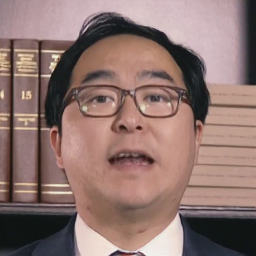
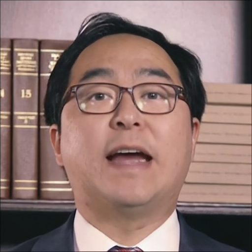
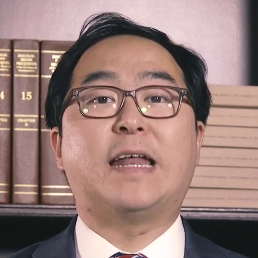

### MetaPortrait: 

||||
|:--:|:--:|:--:|
| **[论文网址](https://arxiv.org/abs/2212.08062)** | **[项目网页](https://meta-portrait.github.io/)** | **[Github](https://github.com/Meta-Portrait/MetaPortrait/tree/v0.0.1)** |

### 部署项目

部署可以按照 Github 的说明进行 ( v0.0.1 )，且此模块并非必须项目，因此在此处不再提供部署说明。

如果出现问题可以考虑通过 conda 使用文件夹下的 `environment.yml` 进行环境配置，`environment.yml` 由本机完成部署的 `WSL ( Ubuntu-20.4 )` 中直接导出。

> 使用其超分辨率模型，在本机 WSL 上推理时间较长, 原作者使用 8 张 A100 进行推理训练，他说推理的很快啊，笑 ^_^ 

```shell
python -m torch.distributed.run --nproc_per_node=1 --master_port=4321 Experimental_root/test.py -opt options/test/same_id.yml --launcher pytorch
```

#### 效果展示

只在其提供的 demo 上进行了推理测试，为了便于评估最后没有使用 ( 用于评估的视频有的分辨率小于 512*512 )

**单帧修复**

|原始低分辨率图像|生成图像|原始高分辨率图像|
|:--:|:--:|:--:|
||||

**视频修复**

<div style="display: flex; justify-content: center; align-items: center; height: 100vh;">
    <video src="./demo/MP.mp4" controls width="512" height="512"></video>
</div>


效果不错，但是感觉时间不是很够，而且不适合评估（论文中有提到说使用超分辨模型提高分辨率会造成一定程度的面部运动的准确性降低）

### 另一个解决分辨率的方法 CodeFormer

||||
|:--:|:--:|:--:|
| **[论文地址](https://arxiv.org/abs/2206.11253)** | **[项目网页](https://shangchenzhou.com/projects/CodeFormer/)** | **[Github](https://github.com/sczhou/CodeFormer)** |

dreamtalk 作者说 CodeFormer 更慢而且存在时间一致性问题，故不采用（面部波动很大，在服务器上试了试，面部很容易变形或者说一眼 AI）

> 而且据说 A100 GPU 上每秒只能处理一帧，相当耗时

#### 效果展示

<div style="display: flex; justify-content: center; align-items: center; height: 100vh;">
    <video src="./demo/CF.mp4" controls width="1024" height="1024"></video>
</div>
