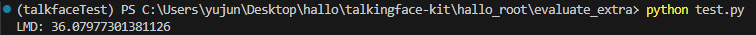

# 配置说明

建议使用Anaconda构建虚拟环境，另外如果在构建dlib时报错，注意检查是否安装cmake，dlib的构建基础是cmake。

# 算法说明

## 原理介绍
LMD 的核心思想是通过比较生成图像（或视频帧）中的关键点（landmarks）和对应真实图像中的关键点，来量化生成结果与真实目标之间的差异。关键点通常指的是脸部关键点，比如眼睛、鼻子、嘴巴等部位的位置。算法分为以下几个步骤：
1. 关键点提取
使用预训练的面部关键点检测模型(dlib 的 shape_predictor_68_face_landmarks.dat权重文件)，从生成的图像和真实图像中提取一组面部关键点坐标。每个关键点坐标表示为二维平面上的点 $(x, y)$。
2. 距离计算
   对应的关键点之间的欧氏距离被用来衡量生成结果与真实目标的相似度。
   $$
    d_i = \sqrt{(x_i^{\text{gen}} - x_i^{\text{real}})^2 + (y_i^{\text{gen}} - y_i^{\text{real}})^2}
    $$
3. 平均距离
   将所有关键点的距离取平均，得到 LMD 值:
   $$
    \text{LMD} = \frac{1}{N} \sum_{i=1}^{N} d_i
    $$
## 测试效果
我们对测试集中的jae-in.mp4进行了测试，得到以下结果

理想情况下，LMD 越低越好，表示生成结果越接近真实。当前值 36.08 是偏高的，表明生成的面部动作和表情与真实视频差距较大。
## 问题分析
通常研究中，LMD 值应低于某个阈值（比如 10-15）才能被认为生成结果较为逼真。而我们在对hallo模型生成的视频进行测试后，发现所得到的LMD值都普遍偏大。这是因为LMD算法的原理是检测每一帧中人脸五官的相对距离，而hallo模型只根据一帧图像生成视频，这导致生成视频的人脸几乎是静止的，所以当原视频中人的头部动作幅度较大时，LMD值就会偏高。

 