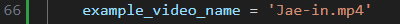

# 项目镜像配置文档
_测试情况：_
+  _源程序测试：_
    + _本机 - NVIDIA GeForce RTX 3050/3060 Laptop + 16G + wsl2 + Ubuntu 22.04.3  - 能够计算除了FID之外的数据_
    + _云服务器：NVIDIA Tesla T4 / 1 * 16G + 32G + Ubuntu 22.04 能够计算所有数据_
+  _镜像测试：_
    + _本机 - NVIDIA GeForce RTX 3050/3060 Laptop + 16G + wsl2 + Ubuntu 22.04.3 + Docker 27.2.0 - 能够计算除了FID之外的数据_
## 一、硬件要求
### 显卡
只测试过NVIDIA GeForce RTX 3050/3060 Laptop
## 二、软件要求
### 1、操作系统
经测试，Ubuntu22.04 符合要求
### 2、docker版本
Docker 27.2.0 及以上
## 三、镜像使用
### 1、构建镜像
使用Dockerfile获取：
由GitHub获取项目源码
```
git clone https://github.com/STF-Zero/talkingface-kit.git
```
进入评估工作目录evaluate_root
```
cd talkingface-kit/hallo_root/evaluate_root
```
构建镜像
```
docker build -t evaluate_image .
```
构建过程中，Debian 的镜像源有时会遇到访问问题而导致构建失败，若出现此问题，可通过以下命令切换Ubuntu的镜像源
```
vim /etc/apt/sources.list

# deb https://mirrors.163.com/debian/ bookworm main non-free contrib
# deb-src https://mirrors.163.com/debian/ bookworm main non-free contrib
# 在sources.list的末尾添加以上两行
```

### 2、新建用于挂载整个项目的文件夹
```
mkdir /home/user/hallo_project_from_image
# user即自己的用户名
```
### 3、启动镜像
```
docker run -it \
 evaluate_image \
 bash
```
+ evaluate_image：
这是要启动的 Docker 镜像的名称和标签。
+ bash：
启动容器后会进入 bash 控制台
#### 使用命令
进入控制台后即可运行main.py来计算 示例视频的 NIQE，PSNR，FID，SSIM，LSE-C，LSE-D。
```
cd Evaluate
python main.py
```
#### 修改参数，计算其他视频
```
apt-get install vim
vim Evaluate/main.py
```
可供计算测试的视频都存放在/MP4目录下

/MP4/Hallo中存放的是Hallo项目生成的视频，/MP4/Source中存放的是原视频

可以修改/Evaluate/main.py中的以下参数为视频的名称

