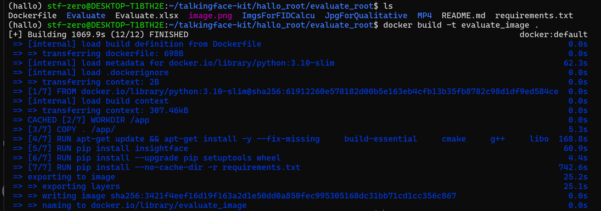

# 项目镜像配置文档
_测试情况：_
+  _源程序测试：_
    + _本机 - NVIDIA GeForce RTX 3050/3060 Laptop + 16G + wsl2 + Ubuntu 22.04.3  - 能够计算除了FID之外的数据_
    + _云服务器：NVIDIA Tesla T4 / 1 * 16G + 32G + Ubuntu 22.04 能够计算所有数据_
+  _镜像测试：_
    + _本机 - NVIDIA GeForce RTX 3050/3060 Laptop + 16G + wsl2 + Ubuntu 22.04.3 + Docker 27.2.0 - 能够计算除了FID之外的数据_
## 一、硬件要求
### 显卡
只测试过NVIDIA GeForce RTX 3050/3060 Laptop
## 二、软件要求
### 1、操作系统
经测试，Ubuntu22.04 符合要求
### 2、docker版本
Docker 27.2.0 及以上
### 3、nvidia-docker2安装
```
# 安装依赖
sudo apt-get update
sudo apt-get install -y \
    curl \
    gnupg2 \
    lsb-release \
    sudo

# 导入 NVIDIA 的 GPG 密钥
curl -s -L https://nvidia.github.io/nvidia-docker/gpgkey | sudo tee /etc/apt/trusted.gpg.d/nvidia.asc

# 添加 NVIDIA 的 Docker 仓库
distribution=$(. /etc/os-release;echo $ID$VERSION_ID)
curl -s -L https://nvidia.github.io/nvidia-docker/$distribution/nvidia-docker.list | sudo tee /etc/apt/sources.list.d/nvidia-docker.list

# 更新 apt 包索引并安装 nvidia-docker2 和 docker.io
sudo apt-get update
sudo apt-get install -y nvidia-docker2 docker.io

# 重启 Docker 服务
sudo systemctl restart docker

```
## 三、镜像使用
### 1、构建镜像
使用Dockerfile获取

由GitHub获取项目源码
```
git clone https://github.com/STF-Zero/talkingface-kit.git
```
进入评估的根目录evaluate_root
```
cd talkingface-kit/hallo_root/evaluate_root
```
构建镜像
```
docker build -t evaluate_image .
```
构建过程中，Debian 的镜像源有时会遇到访问问题而导致构建失败，若出现此问题，可通过以下命令切换Ubuntu的镜像源
```
vim /etc/apt/sources.list

deb https://mirrors.tuna.tsinghua.edu.cn/ubuntu/ focal main restricted universe multiverse
deb https://mirrors.tuna.tsinghua.edu.cn/ubuntu/ focal-updates main restricted universe multiverse
deb https://mirrors.tuna.tsinghua.edu.cn/ubuntu/ focal-backports main restricted universe multiverse
deb https://mirrors.tuna.tsinghua.edu.cn/ubuntu/ focal-security main restricted universe multiverse
# 在sources.list的末尾添加以上四行，用于更改apt镜像源
```
构建过程大约需要20min



### 2、启动镜像
```
docker run -it \
 evaluate_image \
 bash
```
+ evaluate_image：
这是要启动的 Docker 镜像的名称和标签。
+ bash：
启动容器后会进入 bash 控制台
#### 使用命令
进入控制台后即可运行main.py来计算 示例视频的 NIQE，PSNR，FID，SSIM，LSE-C，LSE-D。
```
python3 main.py
```
若报错显示无syncnet_v2.model和sfd_face.pth，则回退至上一级目录，执行以下命令
```
cd Evaluate/syncnet_python
mkdir data
cd data
wget http://www.robots.ox.ac.uk/~vgg/software/lipsync/data/syncnet_v2.model

cd ../detectors/s3fd
mkdir weights
cd weights
wget https://www.robots.ox.ac.uk/~vgg/software/lipsync/data/sfd_face.pth

```
#### 修改参数，计算其他视频
```
apt-get install vim
vim Evaluate/main.py
```
可供计算测试的视频都存放在/MP4目录下

/MP4/Hallo中存放的是Hallo项目生成的视频，/MP4/Source中存放的是原视频

可以修改/Evaluate/main.py中的以下参数为视频的名称

![alt text](image-1.pn