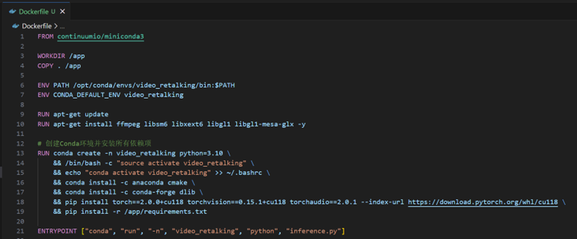
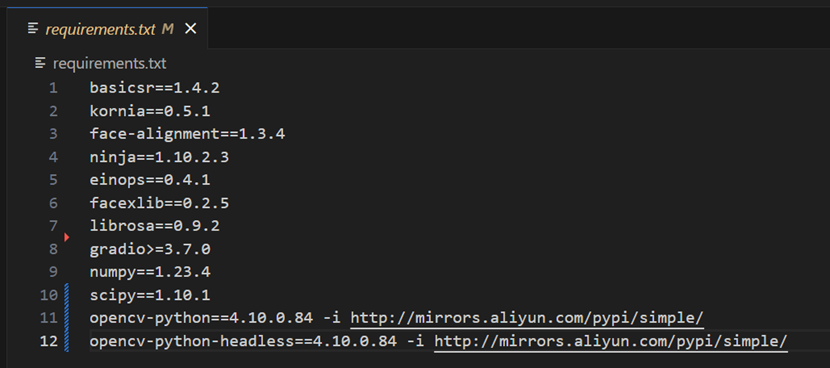
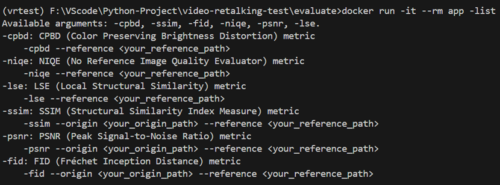
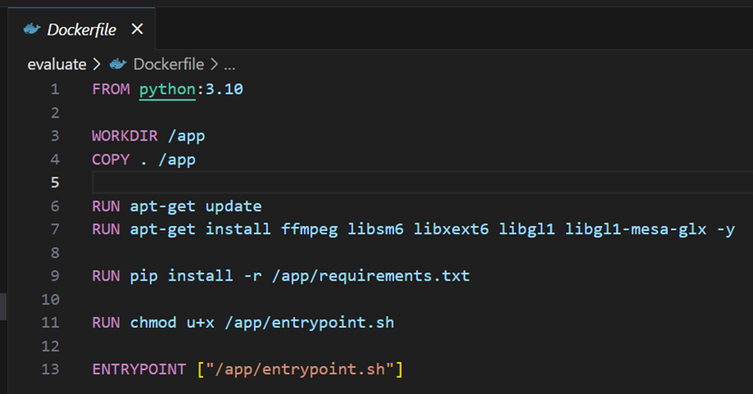
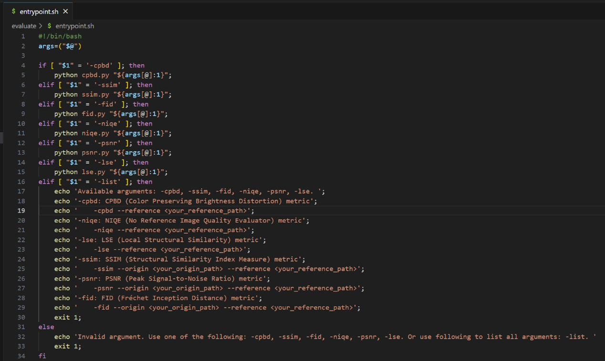

# 语音识别大作业 video-retalking
项目链接 https://github.com/OpenTalker/video-retalking
# 小组成员

贾石浩， 张卓玉，刘璟琦，陈梓镕
#  0 文件说明

`./video-retalking`：目录下包含全部项目源代码（模型需自行下载），手动运行项目请参照该目录下的PAPER_README .md

`./evalute`：目录下包含评估代码

`./evalute/定性评估`：目录下包含定性评估结果

`./evalute/定量评估`：目录下包含定量评估相关代码

`./README.md`：Docker 配置运行文档

`./video-retalking实验报告.txt`：按照北理学报格式
# 1 组内分工及组内评价

## 1.1组长对组员贡献评价

| 组员姓名 | 个人贡献度 |
| ---- | ----- |
| 张卓玉  | 1     |
| 刘璟琦  | 1     |
| 陈梓镕  | 1     |

## 1.2组员对组长评价

| 组员姓名 | 个人贡献度 |
| ---- | ----- |
| 张卓玉  | 1     |
| 刘璟琦  | 1     |
| 陈梓镕  | 1     |
| 均值   | 1     |

# 2 配置文档

## 2.1项目封装成docker形式并完成封装

### 2.1.1 docker的使用

（1）拉取命令

```bash
docker pull corouker/video_retalking:latest
```

（2）运行命令
在Windows终端中执行时

```batch
docker run --gpus all -it --rm ^
-v ".\your_face_path\:/app/examples/face" ^
-v ".\your_audio_path\:/app/examples/audio" ^
-v ".\your_results_path\:/app/results" ^
corouker/video_retalking:latest ^
--face /app/examples/face/1.mp4 ^
--audio /app/examples/audio/1.wav ^
--outfile /app/results/1_1.mp4
```

示例：

```batch
docker run --gpus all -it --rm ^
-v "F:\VScode\Python-Project\video-retalking\examples\face\:/app/examples/face" ^
-v "F:\VScode\Python-Project\video-retalking\examples\audio\:/app/examples/audio" ^
-v "F:\VScode\Python-Project\video-retalking\results:/app/results" ^
corouker/video_retalking:latest ^
--face /app/examples/face/1.mp4 ^
--audio /app/examples/audio/1.wav ^
--outfile /app/results/1_1.mp4
```

在Linux终端中执行时

```bash
docker run --gpus all -it --rm \
-v ./your_face_path/:/app/examples/face \
-v ./your_audio_path/:/app/examples/audio \
-v ./your_results_path/:/app/results \
corouker/video_retalking:latest \
--face /app/examples/face/1.mp4 \
--audio /app/examples/audio/1.wav \
--outfile /app/results/1_1.mp4
```

示例：

```bash
docker run --gpus all -it --rm \
-v /home/zhang/video-retalking/examples/face/:/app/examples/face \
-v /home/zhang/video-retalking/examples/audio/:/app/examples/audio \
-v /home/zhang/video-retalking/results/:/app/results \
corouker/video_retalking:latest \
--face /app/examples/face/1.mp4 \
--audio /app/examples/audio/1.wav \
--outfile /app/results/1_1.mp4
```

说明：

①推理过程请科学上网，否则可能出现连接失败的问题

②your_face_path、your_audio_path、your_results_path用于指定本地的文件路径（建议使用绝对路径）。其中your_face_path表示存放输入视频的文件夹，将被挂载到docker中的/app/examples/face目录下，--face /app/examples/face/1.mp4可指定具体要输入的视频文件；your_audio_path表示存放输入音频的文件夹，将被挂载到docker中的/app/examples/audio目录下，--audio /app/examples/audio/1.wav可指定具体要输入的音频文件；your_results_path表示存放输出视频的文件夹，将被挂载到docker中的/app/results目录下，--outfile /app/results/1_1.mp4可指定具体要输出的文件名

③在Windows终端中，换行符为 ^；在Linux终端中，换行符为 \。在Windows终端中，本地的路径需要使用反斜杠 \，同时为避免转义字符的干扰，最好添加引号，例如：".\your_face_path\:/app/examples/face"；在Linux终端中，本地的路径需要使用正斜杠 /

注：
**--gpus all选项**：用于声明docker在运行时将使用宿主机的GPU，添加该选项请首先确保宿主机安装了NVIDIA驱动程序和NVIDIA Container Toolkit，并确保与CUDA 12.1版本兼容。如果宿主机没有安装前述内容或版本不兼容，运行时请不要添加--gpus all选项，那么将默认使用CPU运行，此时请确保宿主机的内存资源足够，否则推理进程可能被系统强行终止，导致无法得到推理结果
**--shm-size=24g选项**：用于指定内存，当无法使用GPU推理时，请确保分配足够的内存，否则推理进程可能被系统强行终止，导致无法得到推理结果
**-it选项**：用于保证docker提供交互式shell体验，**请确保添加该选项**，否则向docker内传递参数的操作可能失败
**--rm选项**：用于当容器退出时自动删除当前运行的容器（非删除镜像文件，请放心）。**可自由选择是否添加该选项**

### 2.1.2 docker的构建

（1）编写Dockerfile文件
在video-retalking目录下编写该文件



（2）构建docker

```bash
docker build -t app:latest .
```

说明：

①构建过程请科学上网，否则可能出现连接失败的问题

②由于库的兼容性等问题，在原requirement.txt文件的基础上，删除dlib==19.24.0（转为在Dockerfile中使用conda安装），并新增如下三条：

> scipy==1.10.1

> opencv-python==4.10.0.84 -i http://mirrors.aliyun.com/pypi/simple/

> opencv-python-headless==4.10.0.84 -i http://mirrors.aliyun.com/pypi/simple/



③docker构建过程中可能出现部分文件下载失败的问题，可以对docker换源，编辑/etc/docker/daemon.json文件，添加如下内容：

> {
>     "registry-mirrors": [
>         "https://docker.1panel.live",
>         "https://hub.rat.dev"
>     ]
> }

## 2.2 评估封装docker

### 2.2.1 docker的使用

（1）拉取命令

```bash
docker pull corouker/vrtest:latest
```

（2）运行命令
**以下以Linux终端环境执行为例说明，Windows终端需要注意换行符和路径分隔符的区别**
**CPBD指数**的计算需要指定-cpbd，需要传入模型推理生成的视频--reference

```bash
docker run -it --rm \
-v ./your_origin_path/:/app/origin \
-v ./your_reference_path/:/app/reference \
corouker/vrtest -cpbd \
--reference /app/reference/1.mp4
```

**NIQE指数**的计算需要指定-niqe，需要传入模型推理生成的视频--reference

```bash
docker run -it --rm \
-v ./your_origin_path/:/app/origin \
-v ./your_reference_path/:/app/reference \
corouker/vrtest -niqe \
--reference /app/reference/1.mp4
```

**LSE指数**（LSE-C，LSE-D）的计算需要指定-lse，需要传入模型推理生成的视频--reference。需要格外注意的是，由于LSE指数的计算需要依赖模型，而当前docker没有配置GPU支持。因此计算LSE指数需要指定该参数--shm-size=24g，用于分配内存，否则推理进程可能被系统强行终止

```bash
docker run -it --rm --shm-size=10g \
-v ./your_origin_path/:/app/origin \
-v ./your_reference_path/:/app/reference \
corouker/vrtest -lse \
--reference /app/reference/1.mp4
```

**SSIM指数**的计算需要指定-ssim，需要传入原始视频--origin和模型推理生成的视频--reference

```bash
docker run -it --rm \
-v ./your_origin_path/:/app/origin \
-v ./your_reference_path/:/app/reference \
corouker/vrtest -ssim \
--origin /app/origin/1.mp4
--reference /app/reference/1.mp4
```

**PSNR指数**的计算需要指定-psnr，需要传入原始视频--origin和模型推理生成的视频--reference

```bash
docker run -it --rm \
-v ./your_origin_path/:/app/origin \
-v ./your_reference_path/:/app/reference \
corouker/vrtest -psnr \
--origin /app/origin/1.mp4
--reference /app/reference/1.mp4
```

**FID指数**的计算需要指定-fid，需要传入原始视频--origin和模型推理生成的视频--reference。需要格外注意的是，由于FID指数的计算需要依赖模型，而当前docker没有配置GPU支持。因此计算FID指数需要指定该参数--shm-size=12g，用于分配内存，否则推理进程可能被系统强行终止

```bash
docker run -it --rm \
-v ./your_origin_path/:/app/origin \
-v ./your_reference_path/:/app/reference \
corouker/vrtest -fid \
--origin /app/origin/1.mp4
--reference /app/reference/1.mp4
```

使用如下命令可以查看各个指标所需传递的参数情况

```bash
docker run -it --rm corouker/vrtest -list
```




说明：

①推理过程请科学上网，否则可能出现连接失败的问题

②部分指数的计算只需要传入模型推理生成的视频即可（CPBD，NIQE，LSE），另一部分需要同时传入原始视频和模型推理生成的视频（SSIM，PSNR，FID）

③your_origin_path、your_reference_path用于指定本地的文件路径（建议使用绝对路径）。其中your_origin_path表示存放原始视频的文件夹，将被挂载到docker中的/app/origin目录下，--origin /app/origin/1.mp4可指定具体要输入的视频文件；your_reference_path表示存放模型推理生成的视频的文件夹，将被挂载到docker中的/app/reference目录下，--reference /app/reference/1.mp4可指定具体要输入的视频文件


### 2.2.2 docker的构建

此部分文件在evaluate文件夹中

（1）编写Dockerfile文件
编写该文件



其中entrypoint.sh脚本的内容如下



（2）构建docker

```bash
docker build -t app:latest .
```

说明：

构建过程请科学上网，否则可能出现连接失败的问题


